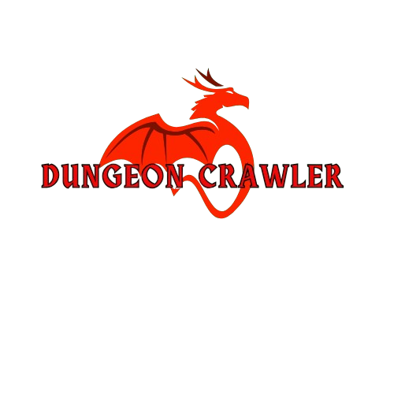

# 🏰 Dungeon Crawler - 2D Java Game

<div align="center">
  
  
  [](https://www.oracle.com/java/)
  [](https://docs.oracle.com/javase/tutorial/uiswing/)
  [](LICENSE)
</div>

## 📖 Overview

A thrilling 2D dungeon crawler game built in Java as a learning project. Navigate through challenging levels, avoid deadly traps, outsmart enemies, and race against time to escape each dungeon. Features multiple levels with increasing difficulty and dynamic enemy AI.

## ✨ Features

### 🎮 Core Gameplay
- **📺 Title Screen** - Clean start menu with background music
- **💀 Game Over Screen** - Retry or quit when defeated
- **🏆 Victory Screen** - Completion celebration with statistics
- **⚡ Real-time FPS Counter** - Performance monitoring
- **❤️ Dynamic Health System** - Visual health bar with damage feedback

### 🎯 Game Mechanics
- **🔥 Static Traps (X)** - Environmental hazards that deal damage
- **🚪 Portal System (.)** - Level progression mechanics  
- **⚔️ Smart Enemy AI** - Enemies chase the hero within detection range
- **🛡️ Invincibility Frames** - 2-second damage immunity after taking hits
- **⏱️ Time Challenge** - 60-second timer per level
- **🏃 Sprint System** - Hold CTRL for increased movement speed

### 🎵 Audio & Visual
- **🎼 Sound Effects** - Immersive audio feedback for actions
- **🎨 Sprite Animation** - Animated character movement
- **🌍 Multiple Environments** - 5 unique level layouts
- **📊 HUD Elements** - FPS, health, timer, and level indicators

## 🎮 Controls

| Key | Action |
|-----|--------|
| `↑ ↓ ← →` | Move character |
| `CTRL` | Sprint (hold) |


## 🗺️ Level Design

The game features 5 handcrafted levels with increasing difficulty:

```
T = Trees (solid walls)    R = Rocks (obstacles)
X = Traps (damage)         . = Portal (exit)
  = Grass (walkable)
```

**Enemy Scaling:**
- **Levels 1-2:** 2 enemies
- **Level 3:** 3 enemies  
- **Level 4:** 4 enemies
- **Level 5:** 5 enemies

## 🛠️ Installation & Setup

### Prerequisites
- Java 8 or higher
- Any Java IDE (IntelliJ IDEA, Eclipse, VS Code with Java extensions)

### Quick Start
1. **Clone the repository:**
   ```bash
   git clone https://github.com/ACHRAFAHAL/Dungeon_crawler.git
   cd Dungeon_crawler
   ```

2. **Open in your IDE:**
   - Import as existing Java project
   - Ensure `src/` is marked as source folder

3. **Run the game:**
   ```bash
   # From command line
   javac -d out src/*.java
   java -cp out Main
   
   # Or run Main.java directly from your IDE
   ```

## 🏗️ Project Structure

```
Dungeon_crawler/
├── src/                    # Source code
│   ├── Main.java          # Application entry point
│   ├── GameEngine.java    # Core game logic & input handling
│   ├── RenderEngine.java  # Graphics & UI rendering
│   ├── PhysicEngine.java  # Movement & collision detection
│   ├── DynamicSprite.java # Player & enemy entities
│   ├── SolidSprite.java   # Environmental objects
│   ├── Playground.java    # Level loading & parsing
│   └── ...               # Additional game classes
├── data/                  # Level definitions
│   ├── level1.txt
│   ├── level2.txt
│   └── ...
├── img/                   # Game assets
│   ├── heroTileSheetLowRes.png
│   ├── enemytilesheet.png
│   └── ...
├── sound/                 # Audio files
└── README.md
```

## 🎯 Architecture Overview

The game follows a clean **Entity-Component-System** inspired architecture:

- **[`Engine`](src/Engine.java)** - Base interface for all game systems
- **[`Displayable`](src/Displayable.java)** - Interface for renderable objects  
- **[`Sprite`](src/Sprite.java)** - Base class for all game objects
- **[`DynamicSprite`](src/DynamicSprite.java)** - Moving entities (player, enemies)
- **[`SolidSprite`](src/SolidSprite.java)** - Static collidable objects

## 🚀 Future Enhancements

- [ ] **Power-ups & Items** - Health potions, speed boosts
- [ ] **Advanced Enemy AI** - Pathfinding, different enemy types
- [ ] **Level Editor** - In-game level creation tools
- [ ] **Multiplayer Support** - Local co-op gameplay
- [ ] **Enhanced Graphics** - Particle effects, better animations
- [ ] **Achievement System** - Unlock rewards and challenges
- [ ] **Save System** - Progress persistence

## 🤝 Contributing

Contributions are welcome! Feel free to:

1. Fork the repository
2. Create a feature branch (`git checkout -b feature/AmazingFeature`)
3. Commit your changes (`git commit -m 'Add some AmazingFeature'`)
4. Push to the branch (`git push origin feature/AmazingFeature`)
5. Open a Pull Request

## 📝 License

This project is licensed under the MIT License - see the [LICENSE](LICENSE) file for details.

## 🙏 Acknowledgments

- **ENSEA Java Labs** - Educational foundation
- **Antoine Tauvel** - Course instructor
- Java Swing documentation and community

---

<div align="center">
  <p><em>Built with ❤️ and Java</em></p>
  <p>⭐ Star this repo if you enjoyed the game!</p>
</div>
